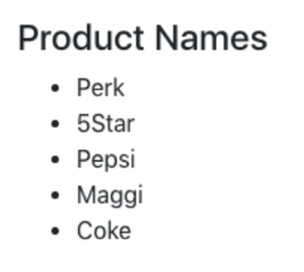
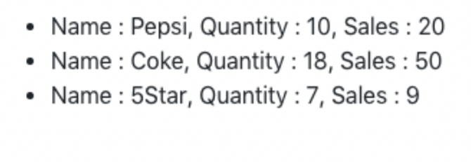
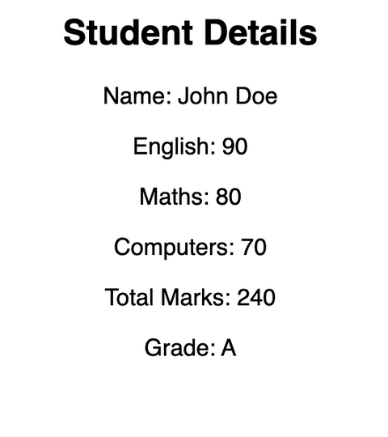

# ReactJS Practice Question Set 1
    Instructions:
    - Do these questions in a React JS template editor.
    
    - You can use React JS CodeSandbox or React JS REPL.
    - This set is mostly about practicing JSX and conditional styling in React. There is NO use of useState hook in this set.
    - You can make use of methods such as .map(), .filter(), .reduce(), .length, toLowerCase(), toUpperCase() wherever needed.
    - Do NOT use for-loops.
## Questions:

1. Build an EmployeeCard component in React to display name, designation and work experience of a person. Pass name, designation and work experience as props.

- The colour of “Designation:” should be green.
- The colour of “Experience:” should be blue.

Solution: codesandbox link

<a href="https://codesandbox.io/s/react-ps1-1-dc2slt" 
target="_blank">Open in new tab</a>

[Click here](https://codesandbox.io/s/react-ps1-1-dc2slt)
      

2. Build a React component to display a button with custom styles and button text as ‘Start’. 
- The styles should be passed as props.

Data:
```jsx
const backgroundColor = 'lightgreen'
const color = 'darkgreen'
const borderRadius = '5px'
const padding = '10px'
```
Solution: codesandbox link
<a href="https://codesandbox.io/s/react-ps1-2-9jnh3x"
target="_blank">Open in new tab</a>

[Click here](https://codesandbox.io/s/react-ps1-2-9jnh3x)

3. Build a React component to display a list of stationery items with a header. 
- The items and header should be passed as props. 
- Header should be “Stationery Items”.

Data:
```jsx
const items = ['pen', 'pencil', 'ruler', 'eraser']
```

Solution: codesandbox link
<a href="https://codesandbox.io/s/react-ps1-3-ylwuuk"
target="_blank">Open in new tab</a>

[Click here](https://codesandbox.io/s/react-ps1-3-ylwuuk)
4. Build a React component to display an image with a caption. The image and caption should be passed as props.

Data:
```jsx
const imageLink =
  'https://cdn.pixabay.com/photo/2023/03/18/10/43/plum-blossoms-7860381_1280.jpg'
const caption = 'Spring Flowers'
```

Solution: codesandbox link

<a href="https://codesandbox.io/s/react-ps1-4-x1w82y"
target="_blank">Open in new tab</a>

[Click here](https://codesandbox.io/s/react-ps1-4-x1w82y)

5. Given the products data. Build a React component to display the name of all products as an unordered list on the DOM. Order of items display can vary from the image shown below.



Data:

```jsx

        const products = [
        { name: 'Perk', quantity: 10, sales: 7 },
        { name: 'Pepsi', quantity: 10, sales: 20 },
        { name: 'Coke', quantity: 18, sales: 50 },
        { name: 'Maggi', quantity: 41, sales: 22 },
        { name: '5Star', quantity: 7, sales: 9 },
    ]
```
6. Consider the products data from previous question and - display all the product details as unordered list for which the number of sales is more than the quantity.
Order of items display can vary from the image shown below.

</img>

7. Given a student object with student name and the marks for english, maths and computers. 
- If the total marks of a student is >= 225, the grade is A, >=180 the grade is B, >=150 the grade is C, otherwise the grade is D. 
- Build a React Component that takes the student object as props and uses it to show all the students details, total marks and grade on the DOM as shown in the image below.

</img>

Data:
```jsx
const student = {
  name: 'John Doe',
  english: 90,
  maths: 80,
  computers: 70,
}
```
8. Build a React component to display all the employee details as unordered list on the DOM in the following format:

```jsx

name: name, level: level, dept: dept, designation: designation, salary: salary
```
- No need to pass as props.

Given Data:
```jsx
const employees = [
  {
    name: 'Jack Smith',
    level: 2,
    dept: 'Tech',
    designation: 'Manager',
    salary: 24000,
  },
  {
    name: 'Mary Robbins',
    level: 3,
    dept: 'Fin',
    designation: 'Manager',
    salary: 28000,
  },
  {
    name: 'Steve Williams',
    level: 4,
    dept: 'Ops',
    designation: 'President',
    salary: 35000,
  },
  {
    name: 'Bob Andrews',
    level: 1,
    dept: 'Fin',
    designation: 'Trainee',
    salary: 16500,
  },
  {
    name: 'Dave Martin',
    level: 2,
    dept: 'Fin',
    designation: 'Manager',
    salary: 21700,
  },
  {
    name: 'Julia Clarke',
    level: 3,
    dept: 'Ops',
    designation: 'Manager',
    salary: 26900,
  },
  {
    name: 'Kathy Jones',
    level: 4,
    dept: 'Tech',
    designation: 'President',
    salary: 42500,
  },
  {
    name: 'Tom Bresnan',
    level: 2,
    dept: 'Tech',
    designation: 'Manager',
    salary: 22200,
  },
]
```
9. Considering above data given in question 8, at the end of all the employee details, calculate and display the total salary expense of the company. Total Salary Expense: totalSalary

10. Considering above data given in question 8, display the details of employee with orange backgroundColor, who are at level 2.

11. Considering above data given in question 8, add a border around the employee details whose designation is “President”.
