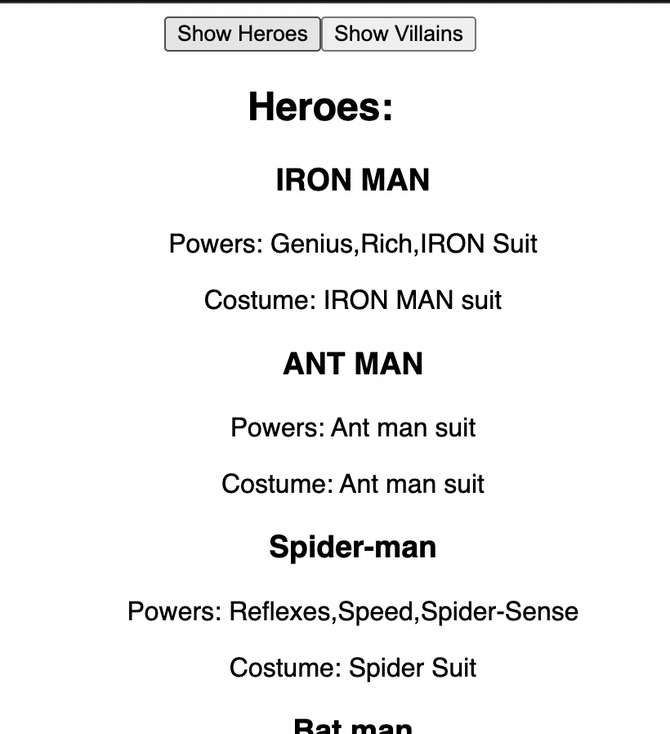
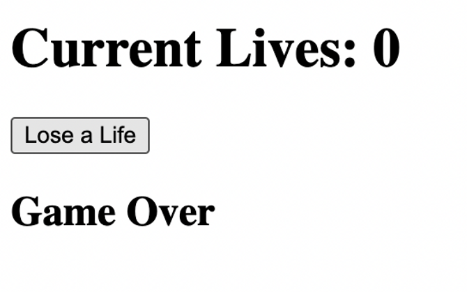

# ReactJS Practice Question Set 4

## Instructions:

    Do these questions in a React JS template editor. You can use React JS CodeSandbox or React JS REPL.
    This set is about practicing useState hook in React.
    You can make use of methods such as .map(), .filter(), .reduce(), .length, .toLowerCase(), .toUpperCase() wherever needed.
    Do NOT use for-loops.

1.Given an array of characters, build a Tab component in React that shows the name of characters on click of two buttons, one for heroes and other for villains. On click of “Show Heroes” button, a list of heroes should be displayed and on click of “Show Villains” button, a list of villains should be displayed on the DOM. Use useState Hook.

```jsx
const characters = {
  heroes: [
    {
      name: "IRON MAN",
      powers: "Genius,Rich,IRON Suit",
      costume: "IRON MAN suit",
    },
    {
      name: "ANT MAN",
      powers: "Ant man suit",
      costume: "Ant man suit",
    },
    {
      name: "Spider-man",
      powers: "Reflexes,Speed,Spider-Sense",
      costume: "Spider Suit",
    },
    {
      name: "Bat man",
      powers: "Rich,Bat suit",
      costume: "Bat Suit",
    },
    {
      name: "Super-man",
      powers: "Superhuman strength,Reflexes,Speed",
      costume: "Superman  Suit",
    },
  ],
  villains: [
    {
      name: "Thanos",
      powers: "Superhuman strength,Reflexes,Speed,",
      costume: "Metal armor",
    },
    {
      name: "Venom",
      powers: "shapeshifting and camouflage Symbiotes autonomous defense",
      costume: "black suit",
    },
    {
      name: "Kang the conqueror",
      powers: "time travel, can access all tech",
      costume: "kang armor",
    },
    {
      name: "Joker",
      powers: "clownlike appearance and sick humour",
      costume: "Joker costume",
    },
  ],
};
```




[click](https://codesandbox.io/s/react-ps4-1-nk4nv5)

2.Build a React component with two buttons + and - which increases/decreases the font size of a heading text “Welcome” by 1px. Keep the initial font size to 18px. Use useState Hook.


[click](https://codesandbox.io/s/react-ps4-2-ylmzcg)

3.Given an array of items:
```jsx
const itemList = [
  { id: 1, name: "Apple", category: "Fruit" },
  { id: 2, name: "Carrot", category: "Vegetable" },
  { id: 3, name: "Banana", category: "Fruit" },
  { id: 4, name: "Broccoli", category: "Vegetable" },
];
```
3(A).Build a React component that displays a list of items. Display fruits in orange color and vegetables in green color.

[click](https://codesandbox.io/s/react-ps4-3-h511xi)


b. Create two buttons to filter the items by their category using the useState hook.


[click](https://codesandbox.io/s/react-ps4-1-nk4nv5)

4.Given an array of todoItems:
```jsx
const todoItems = [
  {id: 1, task: "Writing 1-page poem", isDone: true},
  {id: 2, task: "Gym", isDone: false},
  {id: 3, task: "Shopping", isDone: false},
  {id: 4, task: "Standup call", isDone: true},
]
```
a. Build a React component that takes the todoItems as props and list all the todo tasks. b. if isDone is true then show the item with a strikethrough.

[click](https://codesandbox.io/s/react-ps4-4a-63gt62)


c. Add a X button against each item and remove that task from the list on click of the button.

[click](https://codesandbox.io/s/react-ps4-4b-xv6xnv)


5.Given an array of todoItems:
```jsx
const todoItems = [
  {id: 1, task: "Writing 1-page poem", isDone: false},
  {id: 2, task: "Gym", isDone: false},
  {id: 3, task: "Shopping", isDone: false},
  {id: 4, task: "Standup call", isDone: false},
]
```
a. Build a React component that takes the todoItems as props and list all the todo tasks.

[click](https://codesandbox.io/s/react-ps4-5a-4yv6si)


b. Add a "Mark as Done" button against each item and toggle isDone property value between true and false on click of the button. If isDone is true change the color of that task to red with a strikethrough and if it is false remove the strikethrough and the red color.

[click](https://codesandbox.io/s/react-ps4-5b-4v9m69)


6.Given an array of books:
```jsx
const books = [
  { id: 1, title: "The Great Gatsby", author: "F. Scott Fitzgerald", genre: "Classic" },
  { id: 2, title: "To Kill a Mockingbird", author: "Harper Lee", genre: "Classic" },
  { id: 3, title: "The Catcher in the Rye", author: "J.D. Salinger", genre: "Classic" },
  { id: 4, title: "1984", author: "George Orwell", genre: "Dystopian" },
  { id: 5, title: "Brave New World", author: "Aldous Huxley", genre: "Dystopian" },
  { id: 6, title: "The Hunger Games", author: "Suzanne Collins", genre: "Young Adult" },
  { id: 7, title: "Harry Potter and the Philosopher's Stone", author: "J.K. Rowling", genre: "Young Adult" },
];
```
a. Build a React component that displays the title and author of each book.

[click](https://codesandbox.io/s/react-ps4-6a-k59x1l)

b. Add buttons to filter the books by genre using the useState hook.

[click](https://codesandbox.io/s/react-ps4-6b-5oinyq)


7.Build a game component in React where the player has a certain number of lives. Display the current number of lives and allows the player to decrement the number of lives by one with a button click. Once the number of lives reaches zero, display a "Game Over" message.

[click](https://codesandbox.io/s/react-ps4-7-8bnzs0)


