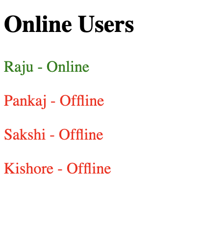
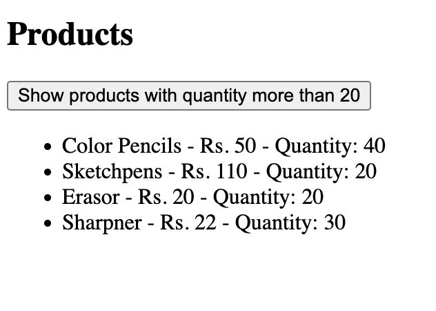
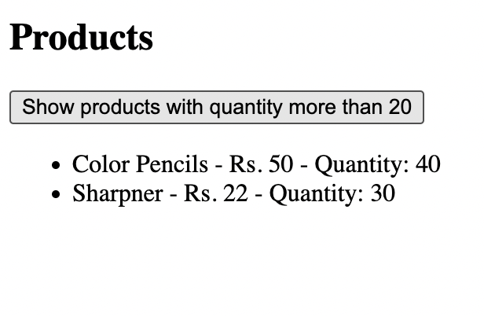
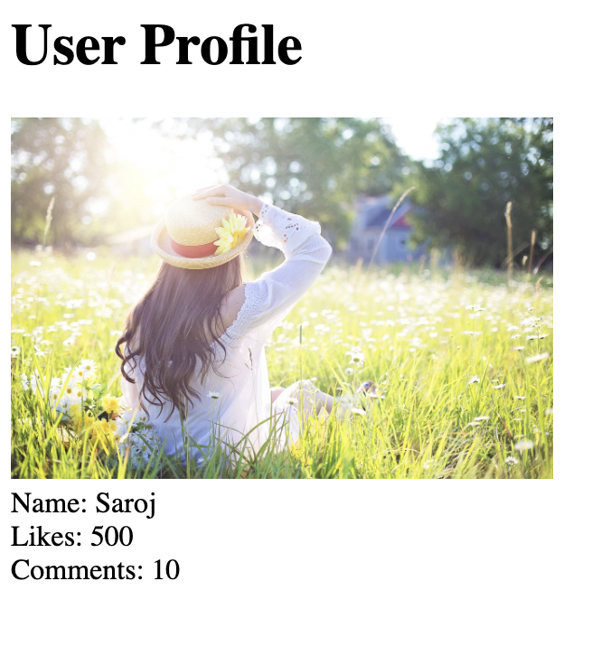
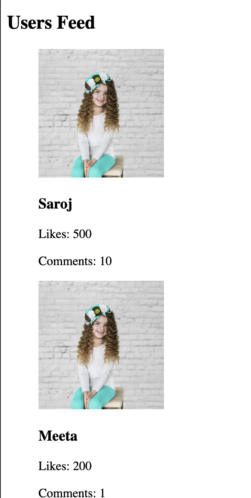
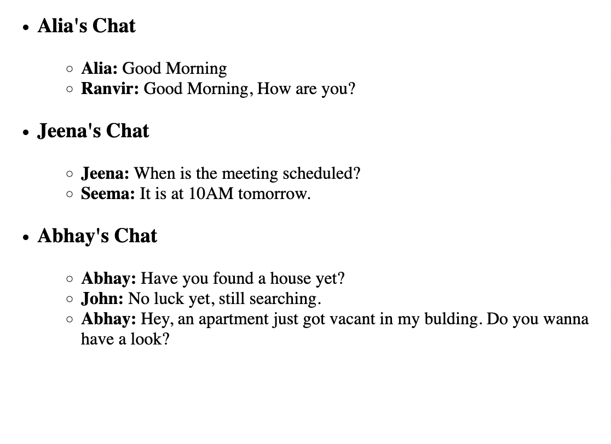
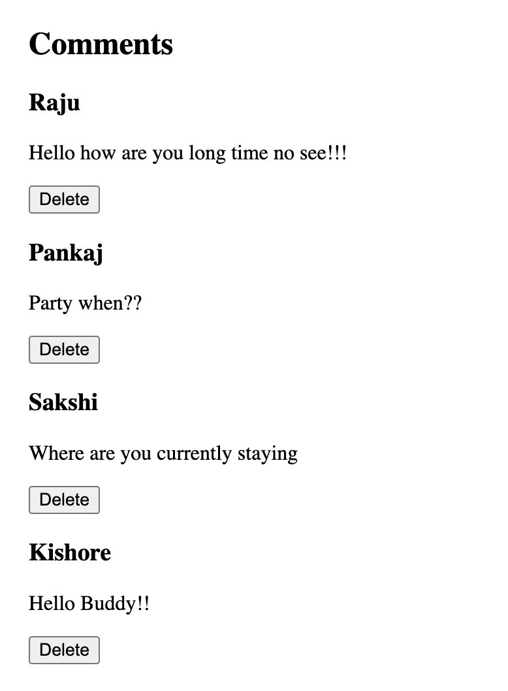

# ReactJS Practice Question Set 5

## Instructions:

    Do these questions in a React JS template editor.
    You can use React JS CodeSandbox or React JS REPL.
    This set is about practicing useEffect and useState hook in React.
    You can make use of methods such as .map(), .filter(), .reduce(), .length, .toLowerCase(), .toUpperCase() wherever needed.
    Do NOT use for-loops.

1.Create a React component where all the users are fetched using fake fetch and listed on the DOM. Show the online users in green color and the offline users in red color.


[click](https://codesandbox.io/s/ps5-1-3khe4z)

fakeFetch has been provided:

```jsx
export const fakeFetch = (url) => {
  return new Promise((resolve, reject) => {
    setTimeout(() => {
      if (url === "https://example.com/api/users/status") {
        resolve({
          status: 200,
          message: "Success",
          data: {
            users: [
              { name: "Raju", status: "Online" },
              { name: "Pankaj", status: "Offline" },
              { name: "Sakshi", status: "Offline" },
              { name: "Kishore", status: "Offline" },
            ],
          },
        });
      } else {
        reject({
          status: 404,
          message: "No users Found",
        });
      }
    }, 2000);
  });
};
```

2.Create a React component that fetches products data from an API endpoint using useEffect hook and display products (name, price, quantity) as a list on the screen using the useState hook.

[click](https://codesandbox.io/s/ps5-2-hy2k3u

a. Add a button, on click of which it displays only the items with more than 20 as quantity.

[click](https://codesandbox.io/s/ps5-2a-nervj4)





fakeFetch has been provided:

```jsx
export const fakeFetch = (url) => {
  return new Promise((resolve, reject) => {
    setTimeout(() => {
      if (url === "https://example.com/api/products") {
        resolve({
          status: 200,
          message: "Success",
          data: {
            products: [
              { name: "Color Pencils", price: 50, quantity: 40 },
              { name: "Sketchpens", price: 110, quantity: 20 },
              { name: "Erasor", price: 20, quantity: 20 },
              { name: "Sharpner", price: 22, quantity: 30 },
            ],
          },
        });
      } else {
        reject({
          status: 404,
          message: "Items list not found.",
        });
      }
    }, 2000);
  });
};
```

3.In the above question after you have listed all the items, add a button which says “Filter by Price”. On click of the button, display only the items with price less than 100.

[click](https://codesandbox.io/s/ps5-3-y8rui8)

4.Create a React component that fetches a user’s data from an API endpoint using useEffect hook and displays the data (name, image, likes, comments) on the screen using the useState hook. Pass heading (”User Profile”) and width and height for image as props to the component.

[click](https://codesandbox.io/s/ps5-4-p9zcz4)



fakeFetch has been provided:

```jsx
export const fakeFetch = (url) => {
  return new Promise((resolve, reject) => {
    setTimeout(() => {
      if (url === "https://example.com/api/user") {
        resolve({
          status: 200,
          message: "Success",
          data: {
            name: "Saroj",
            image:
              "https://cdn.pixabay.com/photo/2016/07/11/15/43/woman-1509956_1280.jpg",
            likes: 500,
            comments: 10,
          },
        });
      } else {
        reject({
          status: 404,
          message: "user data not found.",
        });
      }
    }, 2000);
  });
};
```

5.Create a React component that fetches users data from an API endpoint using useEffect hook and display users data (name, image, likes, comments) as a list on the screen using the useState hook.

a. Show “Loading…” until your data displays on the DOM.

b. Handle errors by showing an error message on the DOM, in case of any error.

[click](https://codesandbox.io/s/ps5-5-z0me9d)



fakeFetch has been provided:

```jsx
// You can use your own images if you wish

export const fakeFetch = (url) => {
  return new Promise((resolve, reject) => {
    setTimeout(() => {
      if (url === "https://example.com/api/users") {
        resolve({
          status: 200,
          message: "Success",
          data: [
            {
              name: "Saroj",
              image:
                "https://cdn.pixabay.com/photo/2017/06/13/13/06/girl-2398822_1280.jpg",
              likes: 500,
              comments: 10,
            },
            {
              name: "Meeta",
              image:
                "https://cdn.pixabay.com/photo/2017/06/13/13/06/girl-2398822_1280.jpg",
              likes: 200,
              comments: 1,
            },
            {
              name: "Alia",
              image:
                "https://cdn.pixabay.com/photo/2017/06/13/13/06/girl-2398822_1280.jpg",
              likes: 100,
              comments: 5,
            },
          ],
        });
      } else {
        reject({
          status: 404,
          message: "users data not found.",
        });
      }
    }, 2000);
  });
};
```

6.Create a React component that fetches chat data from an API endpoint using useEffect hook and display chat data (name and chat message) as a list on the screen using the useState hook.

a. Show “Loading Chats…” until your data displays on the DOM.

[click](https://codesandbox.io/s/ps5-6-eorv5t)



fakeFetch has been provided:

```jsx
export const fakeFetch = (url) => {
  return new Promise((resolve, reject) => {
    setTimeout(() => {
      if (url === "https://example.com/api/userchat") {
        resolve({
          status: 200,
          message: "Success",
          data: [
            {
              name: "Alia",
              messages: [
                {
                  from: "Alia",
                  message: "Good Morning",
                },
                {
                  from: "Ranvir",
                  message: "Good Morning, How are you?",
                },
              ],
            },
            {
              name: "Jeena",
              messages: [
                {
                  from: "Jeena",
                  message: "When is the meeting scheduled?",
                },
                {
                  from: "Seema",
                  message: "It is at 10AM tomorrow.",
                },
              ],
            },
            {
              name: "Abhay",
              messages: [
                {
                  from: "Abhay",
                  message: "Have you found a house yet?",
                },
                {
                  from: "John",
                  message: "No luck yet, still searching.",
                },
                {
                  from: "Abhay",
                  message:
                    "Hey, an apartment just got vacant in my bulding. Do you wanna have a look?",
                },
              ],
            },
          ],
        });
      } else {
        reject({
          status: 404,
          message: "users chat not found.",
        });
      }
    }, 2000);
  });
};
```

7.Create a React component called Comments.

a. Fetch the comments using thefake fetch and list the data on DOM.

[click](https://codesandbox.io/s/ps5-7a-p83rxd)

b. Each comment component will have the text, user’s name and a delete button.

c. On click of the delete button, that particular comment object should be deleted and should not be visible on the DOM.

[click](https://codesandbox.io/s/ps5-7b-ixqpst)



FakeFetch has been provided:

```jsx
export const fakeFetch = (url) => {
  return new Promise((resolve, reject) => {
    setTimeout(() => {
      if (url === "https://example.com/api/comments") {
        resolve({
          status: 200,
          message: "Success",
          data: {
            comments: [
              {
                name: "Raju",
                text: "Hello how are you long time no see!!!",
              },
              { name: "Pankaj", text: "Party when??" },
              { name: "Sakshi", text: "Where are you currently staying" },
              { name: "Kishore", text: "Hello Buddy!!" },
            ],
          },
        });
      } else {
        reject({
          status: 404,
          message: "No comments Found",
        });
      }
    }, 2000);
  });
};
```
