# ReactJS Practice Question Set 6

Instructions:

    Do these questions in a React JS template editor. You can use React JS CodeSandbox or React JS REPL.
    This set is about practicing useEffect and useState hook in React.
    You can make use of methods such as .map(), .filter(), .reduce(), .length, .toLowerCase(), .toUpperCase() wherever needed.
    Do NOT use for-loops.

1.Create a React component that calls the product api and has the same number of buttons as the items in product. On Click of each button show the details of that card only. Example: In the below API we have three products and three buttons.

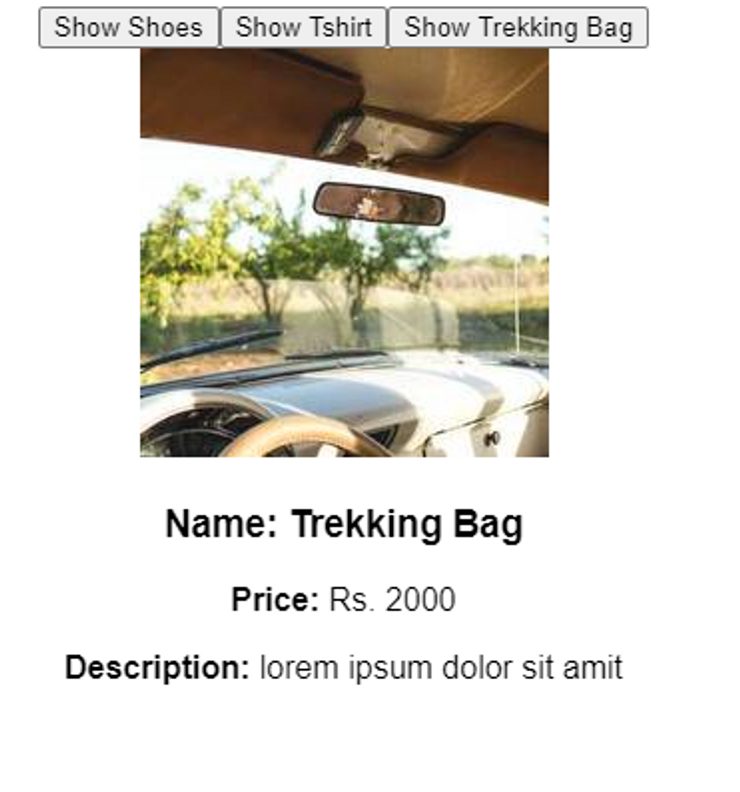

```jsx
const fakeFetch = (url) => {
  return new Promise((resolve, reject) => {
    setTimeout(() => {
      if (url === "https://example.com/api/products") {
        resolve({
          status: 200,
          message: "Success",
          data: {
            products: [
              {
                name: "Shoes",
                price: 3000,
                desc: "lorem ipsum dolor sit amit",
                src: "https://picsum.photos/200/200",
              },
              {
                name: "Tshirt",
                price: 500,
                inStock: false,
                desc: "lorem ipsum dolor sit amit",
                src: "https://picsum.photos/201/201",
              },
              {
                name: "Trekking Bag",
                price: 2000,
                inStock: true,
                desc: "lorem ipsum dolor sit amit",
                src: "https://picsum.photos/205/205",
              },
            ],
          },
        });
      } else {
        reject({
          status: 404,
          message: "Items list not found.",
        });
      }
    }, 2000);
  });
};
```

2.Create a React component that calls the todo api and display the todos in an unordered list and show the todos as a list. The todo should display a heading with a little description of what that todo is about. Under that, it should display all the tasks to be done as a list.

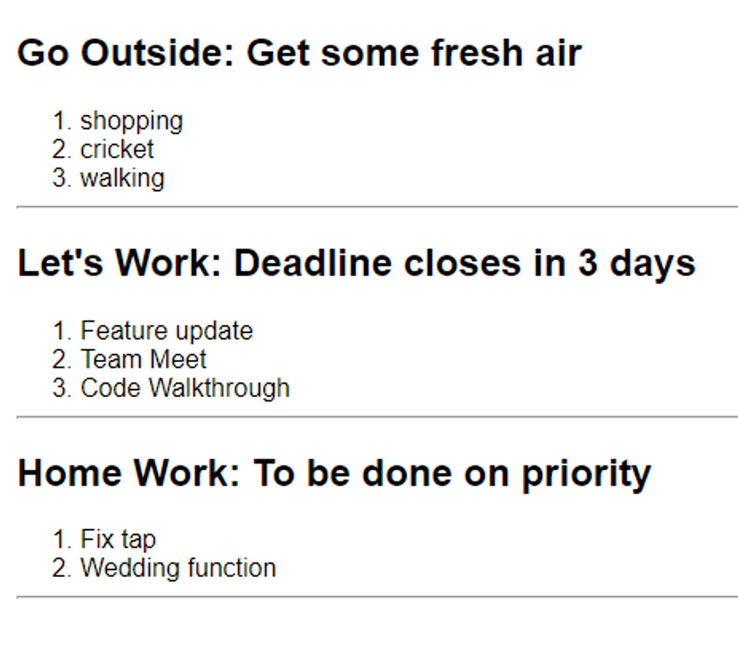

```jsx
const fakeFetch = (url) => {
  return new Promise((resolve, reject) => {
    setTimeout(() => {
      if (url === "https://example.com/api/todos") {
        resolve({
          status: 200,
          message: "Success",
          data: {
            todos: [
              {
                title: "Go Outside",
                desc: "lorem ipsum dolor sit amit",
                todos: ["shopping", "cricket", "walking"],
              },
              {
                title: "Let's Work",
                desc: "lorem ipsum dolor sit amit",
                todos: ["Feature update", "Team Meet", "Code Walkthrough"],
              },
              {
                title: "Home Work",
                desc: "lorem ipsum dolor sit amit",
                todos: ["Fix tap", "Wedding function"],
              },
            ],
          },
        });
      } else {
        reject({
          status: 404,
          message: "Todo list not found.",
        });
      }
    }, 2000);
  });
};
```

3.Create a React component that calls the habit tracker api when the page is loaded completely and display the habits with the total days they were followed and days skipped in between.

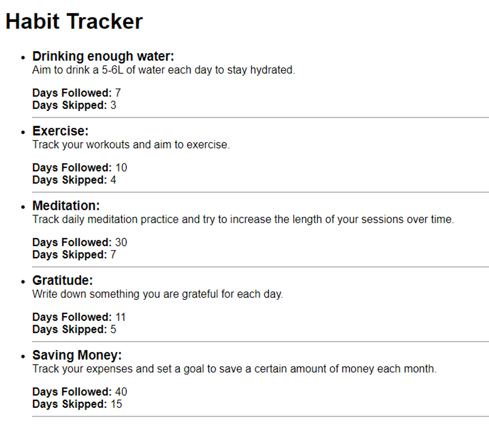

```jsx
const fakeFetch = (url) => {
  return new Promise((resolve, reject) => {
    setTimeout(() => {
      if (url === "https://example.com/api/habits") {
        resolve({
          status: 200,
          message: "Success",
          data: {
            habits: [
              {
                title: "Drinking enough water",
                desc: "Aim to drink 5-6L of water each day to stay hydrated",
                daysFollowed: 7,
                daysSkipped: 3,
              },
              {
                title: "Exercise",
                desc: "Track your workouts and aim to exercise a certain number of days per week",
                daysFollowed: 10,
                daysSkipped: 4,
              },
              {
                title: "Meditation",
                desc: "Track your daily meditation practice and try to increase the length of your sessions over time",
                daysFollowed: 30,
                daysSkipped: 7,
              },
              {
                title: "Gratitude",
                desc: "Write down something you are grateful for each day",
                daysFollowed: 11,
                daysSkipped: 5,
              },
              {
                title: "Saving Money",
                desc: "Track your expenses and set a goal to save a certain amount of money each month",
                daysFollowed: 40,
                daysSkipped: 15,
              },
            ],
          },
        });
      } else {
        reject({
          status: 404,
          message: "Habits not found.",
        });
      }
    }, 2000);
  });
};
```

4.Create a React component that calls the video library api when the page is loaded completely and display all the videos on the screen. And on click of `delete` button, delete the first video in the list.
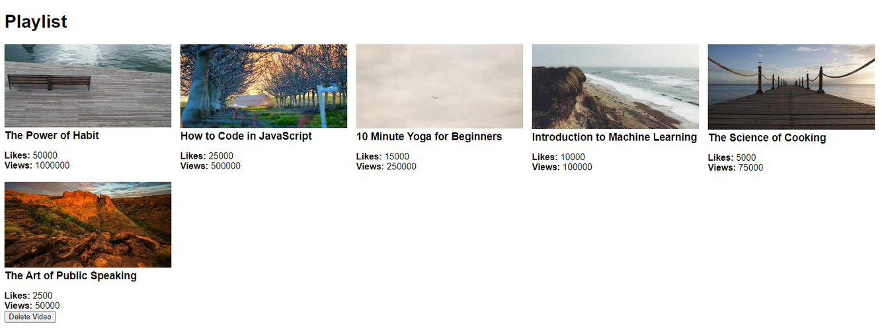

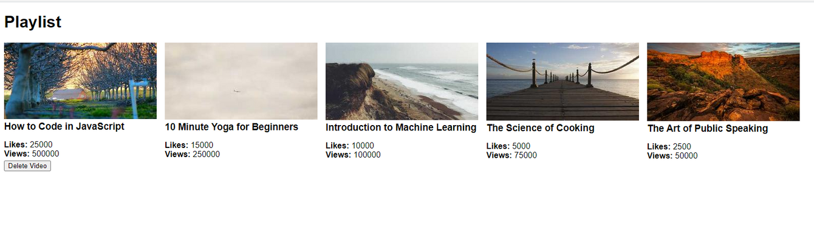

```jsx
const fakeFetch = (url) => {
  return new Promise((resolve, reject) => {
    setTimeout(() => {
      if (url === "https://example.com/api/videos") {
        resolve({
          status: 200,
          message: "Success",
          data: {
            videos: [
              {
                title: "The Power of Habit",
                thumbnail: "https://picsum.photos/200/130",
                views: 1000000,
                likes: 50000,
              },
              {
                title: "How to Code in JavaScript",
                thumbnail: "https://picsum.photos/200/135",
                views: 500000,
                likes: 25000,
              },
              {
                title: "10 Minute Yoga for Beginners",
                thumbnail: "https://picsum.photos/200/131",
                views: 250000,
                likes: 15000,
              },
              {
                title: "Introduction to Machine Learning",
                thumbnail: "https://picsum.photos/200/132",
                views: 100000,
                likes: 10000,
              },
              {
                title: "The Science of Cooking",
                thumbnail: "https://picsum.photos/200/133",
                views: 75000,
                likes: 5000,
              },
              {
                title: "The Art of Public Speaking",
                thumbnail: "https://picsum.photos/200/134",
                views: 50000,
                likes: 2500,
              },
            ],
          },
        });
      } else {
        reject({
          status: 404,
          message: "Videos not found.",
        });
      }
    }, 2000);
  });
};
```

5.Create a react component that calls the social media api when the page is loaded completely and display all the posts on the screen. And on click of `show bakery` button, show only the posts with category as bakery.
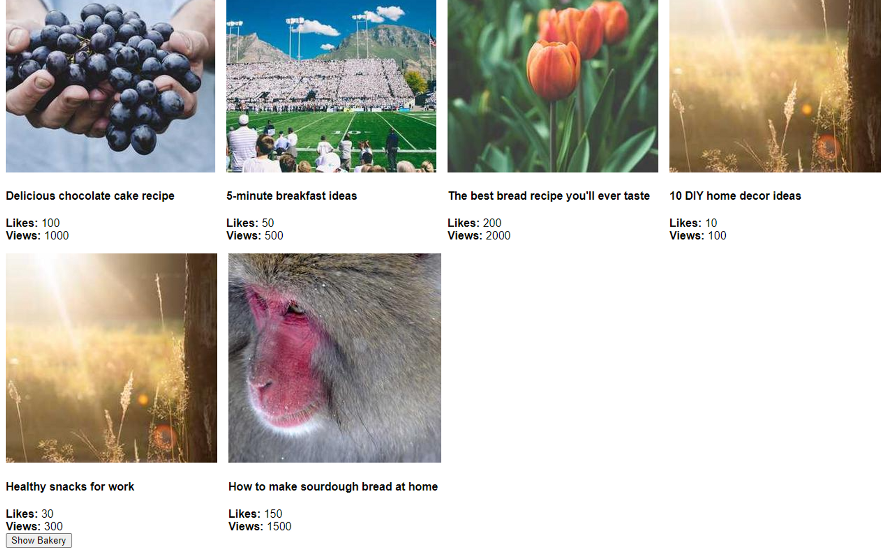

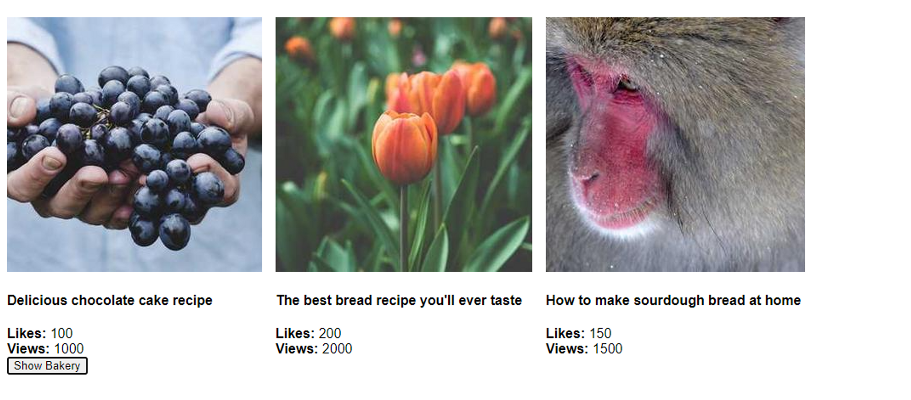

```jsx
export const fakeFetch = (url) => {
  return new Promise((resolve, reject) => {
    setTimeout(() => {
      if (url === "https://example.com/api/posts") {
        resolve({
          status: 200,
          message: "Success",
          data: {
            posts: [
              {
                caption: "Delicious chocolate cake recipe",
                src: "https://picsum.photos/300/301",
                views: 1000,
                likes: 100,
                category: "Bakery",
              },
              {
                caption: "5-minute breakfast ideas",
                src: "https://picsum.photos/300/300",
                views: 500,
                likes: 50,
                category: "Food",
              },
              {
                caption: "The best bread recipe you'll ever taste",
                src: "https://picsum.photos/300/302",
                views: 2000,
                likes: 200,
                category: "Bakery",
              },
              {
                caption: "10 DIY home decor ideas",
                src: "https://picsum.photos/300/303",
                views: 100,
                likes: 10,
                category: "DIY",
              },
              {
                caption: "Healthy snacks for work",
                src: "https://picsum.photos/300/304",
                views: 300,
                likes: 30,
                category: "Food",
              },
              {
                caption: "How to make sourdough bread at home",
                src: "https://picsum.photos/300/305",
                views: 1500,
                likes: 150,
                category: "Bakery",
              },
            ],
          },
        });
      } else {
        reject({
          status: 404,
          message: "Post not found.",
        });
      }
    }, 2000);
  });
};
```

6.Create a React component that calls the habit tracker api and display only the habits which are unarchived with heading “Unarchived”. Create a `show archive` button and on click of `show archive` button show the archive habits and hide the unarchives. Change the heading of the page to “Archived” when the button is clicked.
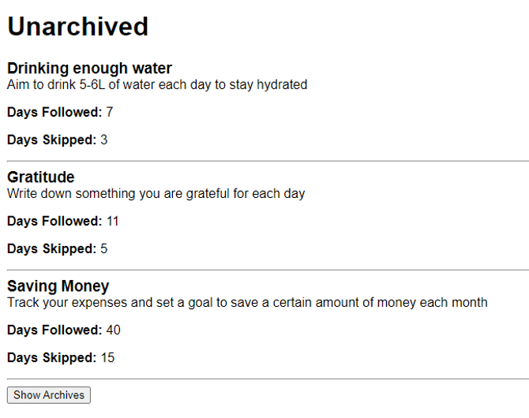
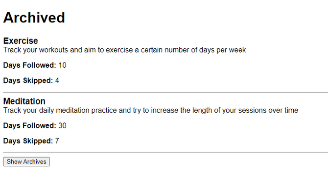

```jsx
export const fakeFetch = (url) => {
  return new Promise((resolve, reject) => {
    setTimeout(() => {
      if (url === "https://example.com/api/habits") {
        resolve({
          status: 200,
          message: "Success",
          data: {
            habits: [
              {
                title: "Drinking enough water",
                desc: "Aim to drink 5-6L of water each day to stay hydrated",
                daysFollowed: 7,
                daysSkipped: 3,
                archived: false,
              },
              {
                title: "Exercise",
                desc: "Track your workouts and aim to exercise a certain number of days per week",
                daysFollowed: 10,
                daysSkipped: 4,
                archived: true,
              },
              {
                title: "Meditation",
                desc: "Track your daily meditation practice and try to increase the length of your sessions over time",
                daysFollowed: 30,
                daysSkipped: 7,
                archived: true,
              },
              {
                title: "Gratitude",
                desc: "Write down something you are grateful for each day",
                daysFollowed: 11,
                daysSkipped: 5,
                archived: false,
              },
              {
                title: "Saving Money",
                desc: "Track your expenses and set a goal to save a certain amount of money each month",
                daysFollowed: 40,
                daysSkipped: 15,
                archived: false,
              },
            ],
          },
        });
      } else {
        reject({
          status: 404,
          message: "Habits not found.",
        });
      }
    }, 2000);
  });
};
```

7.Create a React component that calls the projects api and list all the projects when the page loads with titles and description. Create buttons saying “Show Details” for each project. On click of the button show `title, description, technologies, completed` of that project only.

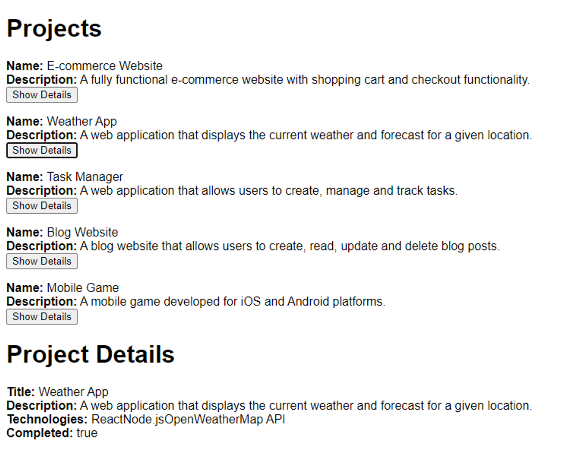

```jsx
export const fakeFetch = (url) => {
  return new Promise((resolve, reject) => {
    setTimeout(() => {
      if (url === "https://example.com/api/projects") {
        resolve({
          status: 200,
          message: "Success",
          data: {
            projects: [
              {
                title: "E-commerce Website",
                description:
                  "A fully functional e-commerce website with shopping cart and checkout functionality.",
                technologies: ["React", "Node.js", "Express", "MongoDB"],
                completed: false,
              },
              {
                title: "Weather App",
                description:
                  "A web application that displays the current weather and forecast for a given location.",
                technologies: ["React", "Node.js", "OpenWeatherMap API"],
                completed: true,
              },
              {
                title: "Task Manager",
                description:
                  "A web application that allows users to create, manage and track tasks.",
                technologies: ["Vue.js", "Firebase"],
                completed: false,
              },
              {
                title: "Blog Website",
                description:
                  "A blog website that allows users to create, read, update and delete blog posts.",
                technologies: ["React JS", "MongoDB"],
                completed: true,
              },
              {
                title: "Mobile Game",
                description:
                  "A mobile game developed for iOS and Android platforms.",
                technologies: ["Unity", "C#"],
                completed: false,
              },
            ],
          },
        });
      } else {
        reject({
          status: 404,
          message: "Projects not found.",
        });
      }
    }, 2000);
  });
};
```

8.Create a React component that calls the userProfile api and list the details of the user when the page loads. Create a button saying`Update name`and on click of that button, change the name of the user.
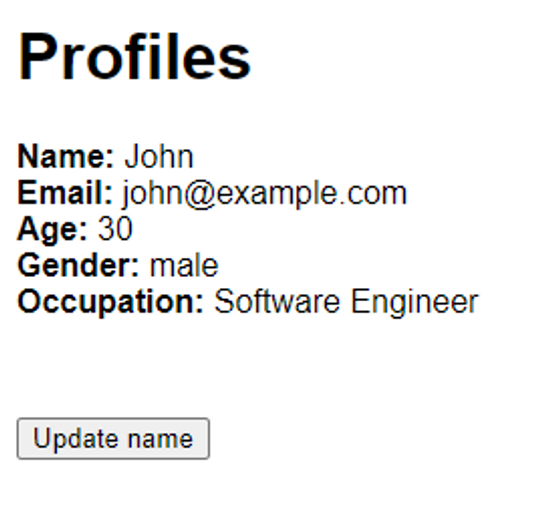

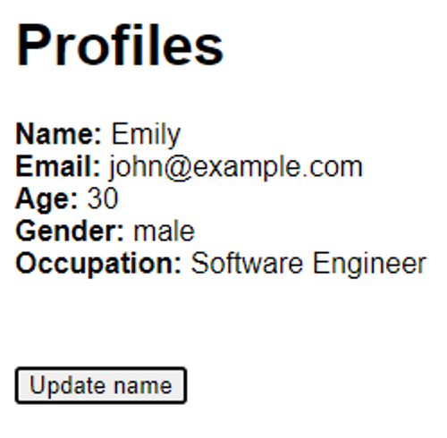

```jsx
export const fakeFetch = (url) => {
  return new Promise((resolve, reject) => {
    setTimeout(() => {
      if (url === "https://example.com/api/profile") {
        resolve({
          status: 200,
          message: "Success",
          data: {
            profiles: {
              name: "John",
              age: 30,
              gender: "male",
              email: "john@example.com",
              occupation: "Software Engineer",
            },
          },
        });
      } else {
        reject({
          status: 404,
          message: "User Profile not found.",
        });
      }
    }, 2000);
  });
};
```

9.Create a React component that calls the video api and display all the details of the video on the screen. And on click of `add label` button, add a label property to the object and display the details on the screen

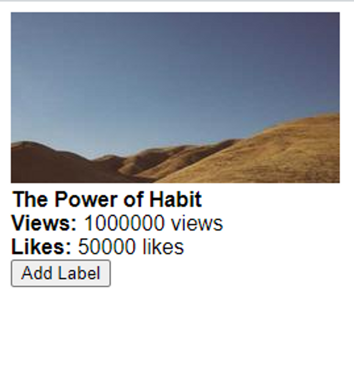

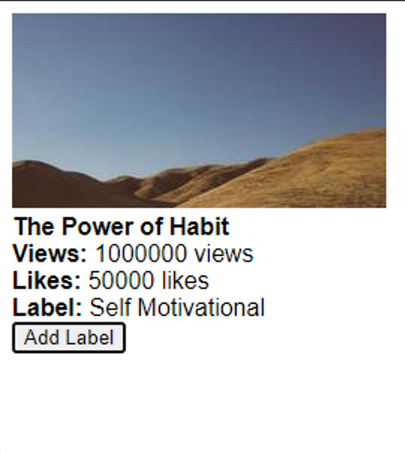

```jsx
export const fakeFetch = (url) => {
  return new Promise((resolve, reject) => {
    setTimeout(() => {
      if (url === "https://example.com/api/getvideo") {
        resolve({
          status: 200,
          message: "Success",
          data: {
            videos: {
              title: "The Power of Habit",
              thumbnail: "https://picsum.photos/250/130",
              views: 1000000,
              likes: 50000,
            },
          },
        });
      } else {
        reject({
          status: 404,
          message: "Video not found.",
        });
      }
    }, 2000);
  });
};
```

10.Create a React component that calls the socialMedia profile api and when the page is loaded show details of the user and a button `follow ` along with the name of the user on the button. On click of that increase the followers count by one and disable the button.

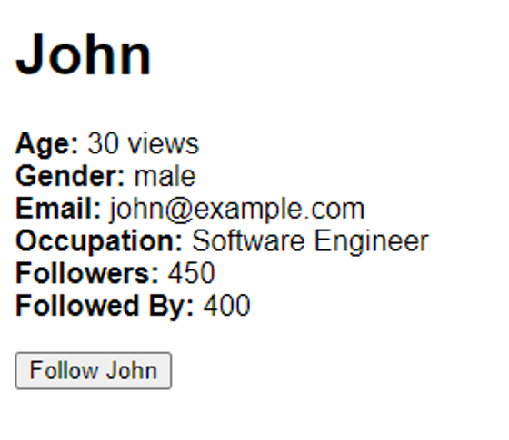

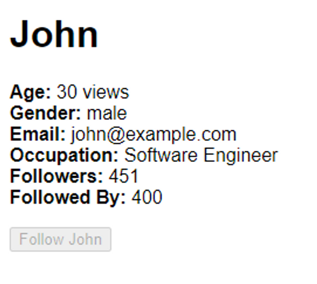

```jsx
export const fakeFetch = (url) => {
  return new Promise((resolve, reject) => {
    setTimeout(() => {
      if (url === "https://example.com/api/profile") {
        resolve({
          status: 200,
          message: "Success",
          data: {
            profile: {
              name: "John",
              age: 30,
              gender: "male",
              email: "john@example.com",
              occupation: "Software Engineer",
              followers: 450,
              followedBy: 400,
            },
          },
        });
      } else {
        reject({
          status: 404,
          message: "Profile not found.",
        });
      }
    }, 2000);
  });
};
```
