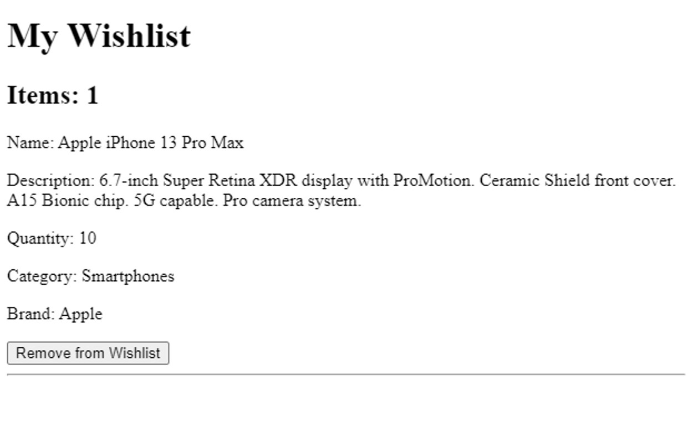

# ReactJS Practice Question Set 8

**1.Create an e-commerce App in React with different routes for:**

- Product listing page - fakeFetch has been provided. Fetch the data and display on the product listing page.
- cart page
- wish list page
- A 404 page should be displayed when user enters wrong url

[Solution ](https://codesandbox.io/s/ps8-1-wcjlqc)

```jsx
export const fakeFetch = (url) => {
  return new Promise((resolve, reject) => {
    setTimeout(() => {
      if (url === "https://example.com/api/products") {
        resolve({
          status: 200,
          message: "Success",
          data: {
            products: [
              {
                id: 1,
                name: "Apple iPhone 13 Pro Max",
                description:
                  "6.7-inch Super Retina XDR display with ProMotion. Ceramic Shield front cover. A15 Bionic chip. 5G capable. Pro camera system. ",
                price: 1099,
                quantity: 10,
                category: "Smartphones",
                brand: "Apple",
              },
              {
                id: 2,
                name: "Samsung Galaxy S21 Ultra",
                description:
                  "6.8-inch Dynamic AMOLED 2X display. Gorilla Glass Victus front and back. Exynos 2100 or Snapdragon 888 chipset. 5G capable. Quad camera system.",
                price: 1199,
                quantity: 8,
                category: "Smartphones",
                brand: "Samsung",
              },
              {
                id: 3,
                name: "Apple MacBook Air",
                description:
                  "13.3-inch Retina display with True Tone. M1 chip. 8-core CPU. 7-core GPU. Up to 18 hours of battery life. ",
                price: 999,
                quantity: 5,
                category: "Laptops",
                brand: "Apple",
              },
              // and so on...
            ],
          },
        });
      } else {
        reject({
          status: 404,
          message: "Items list not found.",
        });
      }
    }, 2000);
  });
};
```

Product listing page


Single item page


Cart Page


Wishlist


Page when you enter wrong URL:


**2.In the above question, in your product listing page add a “Add to Cart” button along with each product. On click of the button, add that item to your cart. The added product should be visible in the My Cart page. Show the total number of items available in the cart at the top of the page. Do this using context.**

[Solution ](https://codesandbox.io/s/ps8-2-59j6ho)


My Cart with total items listed


**3.In the question above, add a “Remove from cart” button in the My Cart page for each product. On click of this button, the product should be removed from the cart.**

[Solution ](https://codesandbox.io/s/ps8-3-xff9xc)


Items removed from cart


**4.In the above question, in your product listing page add a “Add to Wishlist” button along with each product. On click of the button, add that item to your Wishlist page. The added product should be visible in the My Wishlist page. Show the total number of items available in the Wishlist at the top of the page. Do this using context.**

[Solution ](https://codesandbox.io/s/ps8-4-4tptz7)


Wishlist


**5.In the question above, add a “Remove from Wishlist” button in the My Wishlist page for each product. On click of this button, the product should be removed from the Wishlist.**

[Solution ](https://codesandbox.io/s/ps8-5-4b4hb7)


Item removed from Wishlist



**6.Create a Todo App in React with different routes for:**

- Summary of Done and Open Todos page - fakeFetch has been provided. List all the Todos on this page.
- Done Todos page
- Open Todos page
- Page for Individual Todos item to show details of each Todo.

[Solution ](https://codesandbox.io/s/ps8-6-2tz50m)

```jsx
const fakeFetch = (url) => {
  return new Promise((resolve, reject) => {
    setTimeout(() => {
      if (url === "https://example.com/api/todos") {
        resolve({
          status: 200,
          message: "Success",
          data: {
            todos: [
              {
                id: 1,
                title: "Complete practice set 7",
                description: "Practice set 7 of React",
                isCompleted: true,
              },
              {
                id: 2,
                title: "Attend revision session",
                description: "Revision session of React",
                isCompleted: false,
              },
              {
                id: 3,
                title: "Watch recording",
                description: "Live session recording of React",
                isCompleted: true,
              },
              {
                id: 4,
                title: "Attend DSH",
                description: "Doubt Solving Hours of React",
                isCompleted: false,
              },
              {
                id: 5,
                title: "Complete practice set 8",
                description: "Practice set 8 of React",
                isCompleted: false,
              },
              {
                id: 6,
                title: "Watch a movie",
                description: "Watch an old movie from my watchlist",
                isCompleted: true,
              },
            ],
          },
        });
      } else {
        reject({
          status: 404,
          message: "Todos not found.",
        });
      }
    }, 2000);
  });
};
```

Home


Done Todo


Open Todo


Single Todo Page


**7.In the question above, add a Mark as Done button to each todo. Then do the following using context:**

- On click of the button, add that todo to the Done Todos page.
- Show the total number of Todos done on top of the Done Todos pages.
- In the Summary page, strike through that todo.

[Solution ](https://codesandbox.io/s/ps8-7-v2esm4)


Done Todos


**8.In the above question, show the total number of Open Todos on the top of Open Todos page using context.**

[Solution ](https://codesandbox.io/s/ps8-8-l2kruj)


**9.Create a forum app in React with different routes for:**

- Home page
- Questions page
- Answer page

The Home page shows a welcome message with the user's name. The Questions page will list all the questions with 3 buttons: upvote, downvote, and answers. On click of answers button, Answer page should display with that particular question and answer.

[Solution ](https://codesandbox.io/s/ps8-9-ppe66x)

```jsx
export const fakeFetch = (url) => {
  return new Promise((resolve, reject) => {
    setTimeout(() => {
      if (url === "https://example.com/api/questions") {
        resolve({
          status: 200,
          message: "Success",
          data: {
            questions: [
              {
                id: 1,
                question:
                  "What is the difference between null and undefined in JavaScript?",
                answer:
                  "Null means a variable has been declared but has no value. Undefined means a variable has not been declared or has not been assigned a value.",
              },
              {
                id: 2,
                question:
                  "What is the difference between let and var in JavaScript?",
                answer:
                  "Let is block-scoped and var is function-scoped. Variables declared with let can only be accessed within the block they are declared, while variables declared with var can be accessed anywhere within the function they are declared.",
              },
              {
                id: 3,
                question: "What is an arrow function in JavaScript?",
                answer:
                  "An arrow function is a concise way to write a function in JavaScript. It uses the '=>' operator and does not have its own 'this' keyword, so it inherits 'this' from the parent scope.",
              },
            ],
          },
        });
      } else {
        reject({
          status: 404,
          message: "Questions not found.",
        });
      }
    }, 2000);
  });
};
```

Home Page:


Questions Page:


On click of each question’s answer, you should display a single page describing the answer as below:


Well Done! Move on to Practice Set 9
