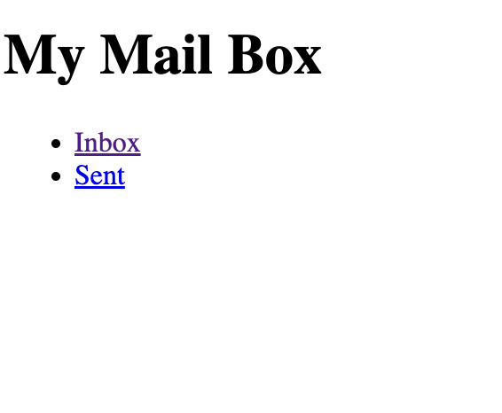
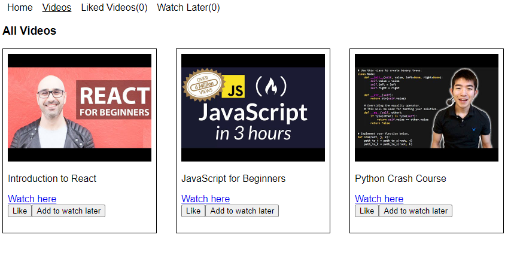
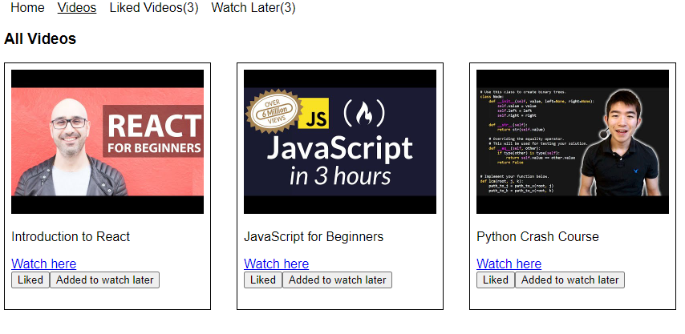

# ReactJS Practice Question Set 9

## Instructions

Do these questions in a React JS template editor. You can use React JS CodeSandbox or React JS REPL.
This set is about practicing React Router and useContext in React.
You can make use of methods such as .map(), .filter(), .reduce(), .length, .toLowerCase(), .toUpperCase(), .push, .includes wherever needed.
Do NOT use for-loops.

Questions

1.Create an Email app in React with different routes:

- **_Landing Page_** - It shows a heading and two routes - Inbox and Sent
- **_Inbox Page_** - It should have the list of all received emails.
- **_Individual Email Page_** - It should show content of that particular opened email.
- Show two counters on the top of Inbox page for number for Read emails and Unread emails. Have a button for each email in the inbox email listing page for emails which have read as false. If you mark an email as read, the counter value for read and unread emails should change.
  Do this using context.
- **_Sent Page_** - It should have the list of all sent emails similar to inbox page but without any buttons to mark as read. If you click on any of the sent emails, it should open that individual email in a unique route.
  Fake fetch has been provided.

Landing Page:



Example


Inbox Page:


Example


Example


Individual Email Page:


Example


```jsx
fakeFetch;

export const fakeFetch = (url) => {
  return new Promise((resolve, reject) => {
    setTimeout(() => {
      if (url === "https://example.com/api/allemails") {
        resolve({
          status: 200,
          message: "Success",
          data: {
            emails: [
              {
                id: 1,
                sender: "John Doe",
                subject: "Hello!",
                message: "How are you?",
                read: false,
              },
              {
                id: 2,
                sender: "Jane Smith",
                subject: "Meeting",
                message: "Reminder of our meeting tomorrow at 2pm.",
                read: true,
              },
              {
                id: 3,
                sender: "Bob Johnson",
                subject: "Proposal",
                message:
                  "Thanks for your proposal. We'll get back to you soon.",
                read: false,
              },
              {
                id: 4,
                sender: "Juana",
                subject: "Follow up on previous email",
                message:
                  "Just checking if you got time to go through my proposal.",
                read: true,
              },
            ],
            sentEmails: [
              {
                id: 5,
                to: "John Doe",
                subject: "Re: Hello!",
                message: "I am Good.",
              },
              {
                id: 6,
                to: "Jane Smith",
                subject: "Re: Meeting",
                message: "Thanks for the reminder. I'll be there.",
              },
              {
                id: 7,
                to: "Bob Johnson",
                subject: "Re: Proposal",
                message: "We are still discussing in the proposal you sent.",
              },
              {
                id: 8,
                to: "Juana",
                subject: "Re: Follow up on previous email",
                message:
                  "We liked your proposal. Let us set up a meeting for further discussion.",
              },
            ],
          },
        });
      } else {
        reject({
          status: 404,
          message: "Email list not found.",
        });
      }
    }, 2000);
  });
};
```

2. Create a books app in React. It should have the following routes:

a. **_Home page_** - This renders all the books coming from the api. Fake fetch has been provided below.

Example


b. Favorites Page


There would be a button along with each of the book of Add to Fav. On clicking that, the book should be added to favourites. Do this using context. And if the book already exists in favourites, the button should be texted Go to Fav - The navbar item should show the count of books in favourites.
Example

c. Read page

There will be button of Mark as read. On clicking it, the book will be added to Read page. Do this using context. If already exists, the button should be texted Already read
Example


d. Profile page - It should display the user details coming from the result of the api.


```jsx
fakeFetch;

export const fakeFetch = (url) => {
  return new Promise((resolve, reject) => {
    setTimeout(() => {
      if (url === "https://example.com/api/books") {
        resolve({
          status: 200,
          message: "Success",
          data: {
            books: [
              {
                id: 1,
                title: "To Kill a Mockingbird",
                author: "Harper Lee",
                publisher: "HarperCollins",
                year: 1960,
                image:
                  "https://m.media-amazon.com/images/W/IMAGERENDERING_521856-T1/images/I/41j-s9fHJcL.jpg",
                price: 9.99,
                read: false,
              },
              {
                id: 2,
                title: "1984",
                author: "George Orwell",
                publisher: "Penguin Books",
                year: 1949,
                image: "https://m.media-amazon.com/images/I/71kxa1-0mfL.jpg",
                price: 8.99,
                read: true,
              },
              {
                id: 3,
                title: "The Catcher in the Rye",
                author: "J.D. Salinger",
                publisher: "Little, Brown and Company",
                year: 1951,
                image:
                  "https://m.media-amazon.com/images/W/IMAGERENDERING_521856-T1/images/I/91HPG31dTwL.jpg",
                price: 10.99,
                read: false,
              },
              {
                id: 4,
                title: "The Great Gatsby",
                author: "F. Scott Fitzgerald",
                publisher: "Scribner",
                year: 1925,
                image: "https://m.media-amazon.com/images/I/71FTb9X6wsL.jpg",
                price: 7.99,
                read: true,
              },
              {
                id: 5,
                title: "Brave New World",
                author: "Aldous Huxley",
                publisher: "Harper Perennial Modern Classics",
                year: 1932,
                image:
                  "https://pagdandi.org/wp-content/uploads/2021/04/Brave-New-World.jpg",
                price: 12.99,
                read: false,
              },
              {
                id: 6,
                title: "Pride and Prejudice",
                author: "Jane Austen",
                publisher: "Penguin Classics",
                year: 1813,
                image: "https://m.media-amazon.com/images/I/71Q1tPupKjL.jpg",
                price: 6.99,
                read: true,
              },
            ],
            user: {
              name: "Raju",
              bio: "25 din mein paisa double",
              img: "https://static-koimoi.akamaized.net/wp-content/new-galleries/2022/12/no-akshay-kumar-no-hera-pheri-3-finally-worked-producers-to-bring-back-khiladi-001.jpg",
            },
          },
        });
      } else {
        reject({
          status: 404,
          message: "Books list not found.",
        });
      }
    }, 2000);
  });
};
```

3. Create an online food ordering app in React, with the following routes.

- a. Home page - Home page should say “Welcome to neoG Food Ordering App” and it should have a button, that navigates to menu page.

- b. Menu page:

- Menu page should display all the items from the menu. Fake fetch has been provided.


Menu page should have a search bar to search for an item.


Menu page should have filters of isVeg , isSpicy and sort by price (both ascending and descending).


Each item should have the button to add that item to cart. On click of the button, that food item should be added to cart, for ordering it. Do this using context. If the item already exists in the cart, make the button text as go to cart on the menu page.

c. Cart Page

Cart page should show all the food items that were added to cart, the total price of all the items in cart, and the total time required to deliver all the products in minutes.

There should be an option to apply coupon which reduces the total cost by 5Rs of the total amount.


```jsx
fakeFetch;

export const fakeFetch = (url) => {
  return new Promise((resolve, reject) => {
    setTimeout(() => {
      if (url === "https://example.com/api/menu") {
        resolve({
          status: 200,
          message: "Success",
          data: {
            menu: [
              {
                id: 1,
                name: "Margherita Pizza",
                description: "Fresh mozzarella, tomato sauce, and basil.",
                price: 12.99,
                image:
                  "https://www.cookingchanneltv.com/content/dam/images/cook/fullset/2011/1/6/0/CCEV103_Margherita-Pizza_s4x3.jpg",
                is_vegetarian: true,
                is_spicy: false,
                delivery_time: 30,
              },
              {
                id: 2,
                name: "Pepperoni Pizza",
                description: "Pepperoni, mozzarella, and tomato sauce.",
                price: 14.99,
                image:
                  "https://static.wixstatic.com/media/597497_39dfa709d3d845eeaf43eb692e93b31b~mv2.jpg/v1/fill/w_6240,h_4160,al_c,q_90/Pepperoni%20Pizza_1_compressed.jpg",
                is_vegetarian: false,
                is_spicy: true,
                delivery_time: 35,
              },
              {
                id: 3,
                name: "Pesto Pasta",
                description: "Penne pasta with homemade pesto sauce.",
                price: 10.99,
                image:
                  "https://silveroak.com/wp-content/uploads/2020/03/Recipe-Basil-Pesto-Pizza.jpg",
                is_vegetarian: true,
                is_spicy: false,
                delivery_time: 25,
              },
              {
                id: 4,
                name: "Chicken Alfredo",
                description:
                  "Fettuccine pasta with creamy Alfredo sauce and grilled chicken.",
                price: 13.99,
                image:
                  "https://assets.kraftfoods.com/recipe_images/opendeploy/120201_640x428.jpg",
                is_vegetarian: false,
                is_spicy: false,
                delivery_time: 40,
              },
              {
                id: 5,
                name: "Tiramisu",
                description:
                  "Classic Italian dessert with ladyfingers, espresso, and mascarpone cream.",
                price: 6.99,
                image:
                  "https://www.countdown.co.nz/Content/Recipes/224513%20Tiramisu%20810x570.jpg",
                is_vegetarian: true,
                is_spicy: false,
                delivery_time: 15,
              },
            ],
          },
        });
      } else {
        reject({
          status: 404,
          message: "Food list not found.",
        });
      }
    }, 2000);
  });
};
```

4. Create a video listing app in React, with the following routes.

- a. Home


b. Videos listing - If you click on “Explore Videos” button or “Videos” in the navbar, you should land to this page.



c. Liked videos - It should show the list of videos that you have liked. If you click on the Like button on the video listing page, that video should get added to the Liked Videos page. Do this using context.

d. Watch later videos - It should show the list of videos that you have added to watch later. If you click on the Add to watch later button on the video listing page, that video should get added to the Watch Later page. Do this using context.



e. Individual video page - “Watch here” should bring you to the individual video page.


```jsx
fakeFetch;

export const fakeFetch = (url) => {
  return new Promise((resolve, reject) => {
    setTimeout(() => {
      if (url === "https://example.com/api/videos") {
        resolve({
          status: 200,
          message: "Success",
          data: {
            videos: [
              {
                id: 1,
                title: "Introduction to React",
                description:
                  "Learn the basics of React in this introductory tutorial",
                url: "https://www.youtube.com/watch?v=Ke90Tje7VS0",
                thumbnail: "https://i.ytimg.com/vi/Ke90Tje7VS0/hqdefault.jpg",
                duration: "12:35",
              },
              {
                id: 2,
                title: "JavaScript for Beginners",
                description:
                  "Get started with JavaScript with this beginner-friendly tutorial",
                url: "https://www.youtube.com/watch?v=PkZNo7MFNFg",
                thumbnail: "https://i.ytimg.com/vi/PkZNo7MFNFg/hqdefault.jpg",
                duration: "20:17",
              },
              {
                id: 3,
                title: "Python Crash Course",
                description:
                  "Learn Python basics in this crash course for beginners",
                url: "https://www.youtube.com/watch?v=Z1Yd7upQsXY",
                thumbnail: "https://i.ytimg.com/vi/Z1Yd7upQsXY/hqdefault.jpg",
                duration: "15:42",
              },
            ],
          },
        });
      } else {
        reject({
          status: 404,
          message: "Video list not found.",
        });
      }
    }, 2000);
  });
};
```
