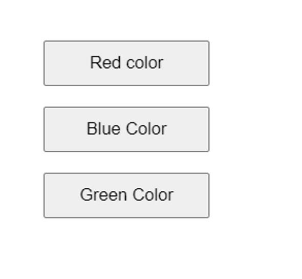

# ReactJS Practice Question Set 2

## Instructions:

    Do these questions in a React JS template editor. You can use React JS CodeSandbox or React JS REPL.
    This set is about practicing JSX, conditional styling and use of useState hook in React.
    You can make use of methods such as .map(), .filter(), .reduce(), .length, toLowerCase(), toUpperCase() wherever needed.
    Do NOT use for-loops.

1.Create a React component called Greeting that receives a name prop and displays a message like "Hello, name!" on the DOM.

[click here](https://codesandbox.io/s/react-ps2-0-3mrgrj)


2.Build a Product component that receives product name and price as props and displays them on DOM.

- The name should be in bold and blue in color
- Price should be in italics and green in color

[click here](https://codesandbox.io/s/react-ps2-0-3mrgrj)


3.Build a React component called UserProfile that receives an object representing a user as prop and display the details on the DOM.

Data:
```jsx
const userData = {
  name: 'John',
  age: 25,
  email: 'john@example.com',
}
```
[click here](https://codesandbox.io/s/react-ps2-0-3mrgrj)

4.Build a React component called Gadgets that receives an array of products as a prop. Render each product's name, description, and price as an ordered list. Add a border around the product details which has price above 50000.

Data:
```jsx
const products = [
  {
    id: 1,
    name: 'keyboard',
    description: 'Logitech Mechanical Keyboard',
    price: 2000,
  },
  { id: 2, name: 'mouse', description: 'Dell Wireless Mouse', price: 1200 },
  {
    id: 3,
    name: 'monitor',
    description: 'Lenovo 32-inch display Monitor',
    price: 10000,
  },
  { id: 4, name: 'mobile', description: 'iPhone 13 Pro Max', price: 140000 },
  {
    id: 5,
    name: 'speakers',
    description: 'Creative Desktop Speakers',
    price: 5000,
  },
  {
    id: 6,
    name: 'headphones',
    description: 'Sony over-the-ear wired Headphones with mic',
    price: 1500,
  },
  { id: 7, name: 'mobile', description: 'iPhone 12', price: 90000 },
]
```
[click here](https://codesandbox.io/s/react-ps2-0-3mrgrj)


5.Build a React component called Phones that receives an array of products as a prop. Display only the mobile phones as an unordered list. Display their name, description, and price on the DOM.

Data:
```jsx
const products = [
  {
    id: 1,
    name: 'keyboard',
    description: 'Logitech Mechanical Keyboard',
    price: 2000,
  },
  { id: 2, name: 'mouse', description: 'Dell Wireless Mouse', price: 1200 },
  { id: 3, name: 'mobile', description: 'iPhone 13', price: 61000 },
  {
    id: 4,
    name: 'monitor',
    description: 'Lenovo 32-inch display Monitor',
    price: 10000,
  },
  { id: 5, name: 'mobile', description: 'iPhone 13 Pro Max', price: 140000 },
  {
    id: 6,
    name: 'speakers',
    description: 'Creative Desktop Speakers',
    price: 5000,
  },
  {
    id: 7,
    name: 'headphones',
    description: 'Sony over-the-ear wired Headphones with mic',
    price: 1500,
  },
  { id: 8, name: 'mobile', description: 'iPhone 12', price: 90000 },
]
```

[click here](https://codesandbox.io/s/reactjs-2-5-1tkscj)


6.Build a React component called Article that accepts two props: title and content. Inside the component, render a `<h1>` tag with the title prop and a button below that which says “Know More”. On the click of the button, show the content in a <p> tag just below the button.

Data:
```jsx
const title = 'React is awesome'
const content = 'React is a JavaScript library for building user interfaces.'
```
[click here](https://codesandbox.io/s/reactjs-2-6-fs99nv)


7.Build a React component called About that accepts three props: heading, your name and learning. Inside the component, render a `<h1>` tag with the heading prop, `<h2>` tag with your name and a button below that which says “Know More”. On the click of the button, show the learning in a `<p>` tag just below the button.

Data:
```jsx
const heading = 'About Me'
const name = 'Preeti' // you can put your name
const learning = 'I am learning React JS currently at neoG Camp.'
```

[click here](https://codesandbox.io/s/reactjs-2-7-im2wkf)


8.Build a React component called MyGadgets that receives an array of products as a prop. Render each product's name, description, and price as an ordered list. Create a button below all the listings which says “Highlight Expensive Gadget” and on click of the button add a lightgreen backgroundColor to the items which has a price more than 50000.

Data:
```jsx
const products = [
  {
    id: 1,
    name: 'keyboard',
    description: 'Logitech Mechanical Keyboard',
    price: 2000,
  },
  { id: 2, name: 'mouse', description: 'Dell Wireless Mouse', price: 1200 },
  {
    id: 3,
    name: 'speakers',
    description: 'Bose L1 Pro32 Portable',
    price: 256000,
  },
  { id: 4, name: 'mobile', description: 'iPhone 13', price: 61000 },
  {
    id: 5,
    name: 'monitor',
    description: 'Lenovo 32-inch display Monitor',
    price: 10000,
  },
  { id: 6, name: 'mobile', description: 'iPhone 13 Pro Max', price: 140000 },
  {
    id: 7,
    name: 'speakers',
    description: 'Creative Desktop Speakers',
    price: 5000,
  },
  {
    id: 8,
    name: 'headphones',
    description: 'Sony over-the-ear wired Headphones with mic',
    price: 1500,
  },
  { id: 9, name: 'mobile', description: 'iPhone 12', price: 90000 },
]
```

[click here](https://codesandbox.io/s/reactjs-2-8-f1c1of)


9.Build a React component called "ColorPicker" that displays a list of colors as buttons. On click of each button show the HEX code for that color, just below each button.

Data:
```jsx
const red = '#EE4B2B'
const blue = '#89CFF0'
const green = '#7FFFD4'
```



[click here](https://codesandbox.io/s/reactjs-2-9-gegqgd)


10.Build a "Todo" React component that takes a prop called "todoItems". Inside the component, Display the title of a to-do item in a heading tag and the description in a paragraph. If the todoItem is completed, show the title and description in green color otherwise in red color.

Data:
```jsx
const todoItems = [
  {
    id: 1,
    title: 'Complete practice set',
    description: 'Practice set 1 of React',
    isCompleted: true,
  },
  {
    id: 2,
    title: 'Attend revision session',
    description: 'Revision session of React',
    isCompleted: false,
  },
  {
    id: 3,
    title: 'Watch recording',
    description: 'Live session recording of React',
    isCompleted: true,
  },
  {
    id: 4,
    title: 'Attend DSH',
    description: 'Doubt Solving Hours of React',
    isCompleted: false,
  },
  {
    id: 5,
    title: 'Complete practice set',
    description: 'Practice set 2 of React',
    isCompleted: false,
  },
]

[click here](https://codesandbox.io/s/reactjs-2-10-1m576t)
